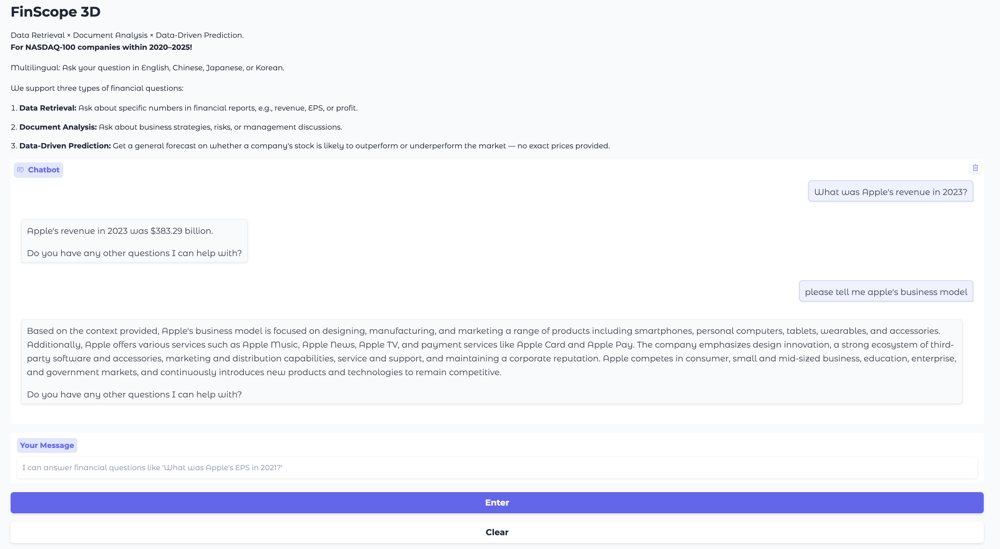

# FinScope3D

### 🧠 A Multimodal Financial Question Answering System

---

## 📺 Live Demo (Click here to watch the demo on Google Drive)

---

## 🌒 Preview

---

## 🧩 Overview

**FinScope3D** is a multimodal financial QA system that integrates natural language understanding, named entity recognition (NER), structured and unstructured data processing, and predictive modeling to deliver insightful responses to financial queries.

---

## ⚙️ System Architecture

The system is divided into four major components:

1. **🧠 NER Module**  
   Extracts key entities like companies, dates, metrics, and events using:
   - Hugging Face Transformers  
   - Custom rules for financial domain  

2. **🧾 Structured Data**  
   Handles database queries and structured analysis using:
   - SQLite  
   - OpenAI for semantic understanding  
   - ChromaDB for vector search  

3. **📚 Unstructured Data**  
   Retrieves insights from financial transcripts and news using:
   - LangChain  
   - ChromaDB  
   - OpenAI
   - Neo4j for graph-based entity linking  

4. **📈 Prediction Module**  
   Performs data-driven financial prediction tasks using:
   - LightGBM  
   - Optuna for hyperparameter tuning  
   - Window-based time series techniques  

---

## 🧰 Tech Stack

- **LLMs**: OpenAI, Hugging Face
- **NER**: Hugging Face Transformers(flair/ner-english-ontonetoes-large)
- **Intent Classification**: Custom LLM Agent(OpenAI)
- **Vector Store**: ChromaDB
- **Graph Database**: Neo4j
- **Unstructured Query**: LangChain + OpenAI + Neo4j
- **Structured Query**: SQLite + OpenAI
- **Prediction Models**: LightGBM, Optuna
- **Frontend**: Gradio

---

## 📌 Key Features

- 🔎 Intelligent financial entity extraction  
- 🧭 Intent-aware question routing  
- 🧠 Graph-based entity relationship reasoning with Neo4j  
- 📊 ML-based financial predictions  
- 💬 Multilingual input/output  
- ⚡ Fast response via lightweight backend  

---

## 📂 Data Access

Due to GitHub’s file size limitations, large ChromaDB database files are stored externally on Google Drive.

Please download the following folders and place them in the appropriate paths within the project structure:

- 🏛️ **Structured ChromaDB**  
  📁 [`Structured_Data/chroma_db`](https://drive.google.com/drive/folders/1uWigilOWapPTSHiSiLOQDppN-RQQUyOu?usp=drive_link)

- 📰 **Unstructured ChromaDB**  
  📁 [`Unstructured_Data/chroma_db`](https://drive.google.com/drive/folders/1QVCrxMwzFuyMUlW64S9sSkjZG2i3lmyB?usp=drive_link)

⚠️ These folders are required for vector-based retrieval.  
Make sure to place them in the exact matching directories for the system to function properly:

---

## 📄 License

MIT License

---

## ✨ Contributors

Made with Jay Wu, Ray Chang, Yu-Ting Chen, Ingrid Tseng
